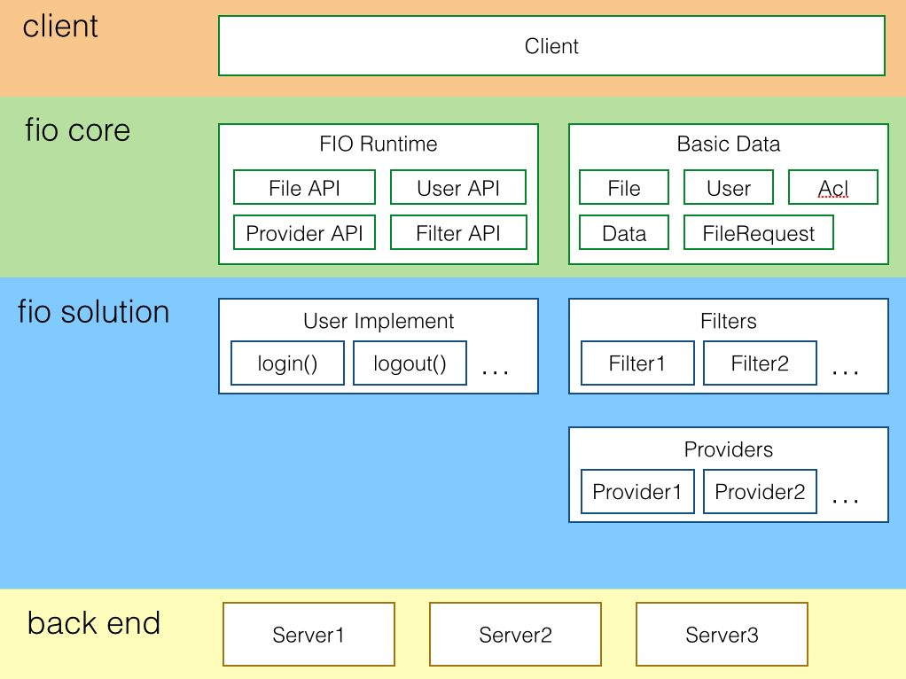

FIO 接口规范说明
==========

| 版本 | 修订人 | 修订原因 | 修订日期 |
|-----|-------|---------|---------|
| 1.0 | 刘家鸣 | 新建 | 2014-07-14 |
| 1.1 | 刘家鸣 | 添加 mkdir 接口 | 2014-07-15 |


## 定位

FIO 希望能解决前端复杂应用中数据的输入、输出、解析、打包、权限等功能的接口问题，降低其开发成本。

## 解决的问题

1. 账号管理 - fio.user
2. IO 提供方管理 - fio.provider
3. 文件管理 - fio.file
4. 过滤器管理 - fio.filter

## 角色及运行说明

在 FIO 中，FIO 充当一个规范化的角色。为 `客户（client）`、`提供方（provider）`、`过滤器（filter）` 和 `用户（user）` 提供接口来进行数据的操作。

* 客户（client）：使用 FIO 来获得数据支持的应用，即 FIO API 的使用方
* 提供方（provider）：为 FIO 提供数据支持的代码
* 过滤器（filter）：为 FIO 提供数据过滤支持的代码
* 用户（user）：客户的使用用户群体，或者是客户应用的使用者的身份



## 基本数据

FIO 需要以下最进本的数据类的支持。包括 User、Data、File、FileRequest。

### fio.user.User

表示一个用户，其中包含的字段为：

#### .id

表示用户的 id

#### .username

表示用户的用户名


### fio.file.Data

表示一个数据，这个数据用于在过滤器中传递，其中包含的字段包括：

#### .type

表示文件的数据类型，支持的取值以及意义分别为：

* `fio.file.TYPE_TEXT`
      表示当前文件是纯文本文件，此时 `file.content` 的类型为 String
* `fio.file.TYPE_JSON`
      表示当前文件是 JSON 文件，此时 `file.content` 的类型为 Object。注意，如果 `file.content` 是 JSON 字符串，那么类型应该为 `TYPE_TEXT`。
* `fio.file.TYPE_BLOB`
      表示当前文件是二进制文件，此时 `file.content` 的类型为 Blob。

允许过滤器拓展并修改该字段，但原则是过滤的最原始 source 和最终的 result 只能是上述三种类型。

#### .content

表示文件的数据。针对不同的 `type` 属性会有不同的类型。


### fio.file.File

表示一个文件，其中包含的字段包括：

#### .path

文件的路径，标识文件的位置，针对不同的提供方可以有会有不同的格式

#### .name

表示文件的名称（不包含扩展名）

#### .extension

表示文件的扩展名，字母部分应全部小写，包含字母前的 '.' 号，如 ".jpg", ".xmind" 等。

#### .format

表示文件的格式，应该以 [MIME](http://zh.wikipedia.org/wiki/%E5%A4%9A%E7%94%A8%E9%80%94%E4%BA%92%E8%81%AF%E7%B6%B2%E9%83%B5%E4%BB%B6%E6%93%B4%E5%B1%95) 格式描述。如 "text/plain"、"application/json"、"application/xmind" 等。

#### .data

表示文件的数据，类型是 `fio.file.Data`

#### .isDir

表示文件是否一个目录

#### .size

表示文件的大小，单位是字节。如果文件是目录，该值为 0。

#### .createTime

表示文件的创建时间

#### .modifyTime

表示文件的修改时间


### fio.file.FileRequest

抽象类，表示一个文件操作请求，所有文件请求都有 fio 产生，交给提供方处理。

#### .path

表示请求的路径，比如要读取、写入、移动、列表、删除的路径。

#### .user

表示发送请求的用户

#### .method

表示要进行的文件操作，允许的取值及其意义为：

* `fio.file.METHOD_READ` - 文件读取
* `fio.file.METHOD_WRITE` - 文件写入
* `fio.file.METHOD_LIST` - 文件列表
* `fio.file.METHOD_MOVE` - 文件移动
* `fio.file.METHOD_DELETE` - 文件删除
* `fio.file.METHOD_MKDIR` - 创建目录
* `fio.file.METHOD_ACL_READ` - 文件 ACL 读取
* `fio.file.METHOD_ACL_WRITE` - 文件 ACL 写入

#### .path

* 请求文件读取时，表示要读取的文件的路径
* 请求文件写入时，表示要写入的文件的路径
* 请求文件列表时，表示要请求列表的目录路径
* 请求文件移动时，表示要移动的文件的路径
* 请求文件删除时，表示要删除的文件的路径
* 请求创建目录时，表示要创建的目录的路径
* 请求文件 ACL 读取时，表示要读取 ACL 的文件的路径
* 请求文件 ACL 写入时，表示要写入 ACL 的文件的路径

#### .dupPolicy

在进行文件写入的时候，表示遇到重复文件时采取的策略，允许的取值及其意义为：

`fio.file.DUP_OVERWRITE` - 表示直接覆盖重复的文件
`fio.file.DUP_FAIL` - 表示应该报错指示文件已存在
`fio.file.DUP_RENAME` - 表示应该重命名保存的文件使其不重复

#### .newPath

在进行文件移动的时候，表示要移动的文件的新路径。

#### .acl

进行文件 ACL 写入的时候，要写入的 ACL

#### .extra

客户调用文件请求时附加的未约定的字段。可能针对具体的提供方有用。


### fio.file.Acl

表示一个访问控制列表，其中包含的字段或方法为：

#### .path

访问列表针对的文件或目录

#### .user

表示访问列表的目标用户，如果 `Acl.access` 的 PUBLIC 位为真，该字段为 0

#### .access

表示支持的访问，支持的取值及其意义为：

* `fio.file.ACCESS_ADMIN = 0xfe`
      指定用户拥有该路径的所有权限（包括任意拓展的权限）
* `fio.file.ACCESS_READ = 0x02`
      指定用户拥有该路径的读取权限
* `fio.file.ACCESS_WRITE = 0x04`
      指定用户拥有该路径的写入权限
* `fio.file.ACCESS_CREATE = 0x08`
      指定用户拥有该路径的创建权限
* `fio.file.ACCESS_DELETE = 0x10`
      指定用户拥有该路径的删除权限
* `fio.file.ACCESS_ACL = 0x20`
      指定用户拥有该路径 ACL 的访问权限
* `fio.file.ACCESS_PUBLIC = 0x01`
      指定当前权限对任意用户有效

`access` 字段是按位表示其访问能力的，上述的取值所在的位值分别为：

| 访问\位 | 15 - 8 | 7 | 6 | 5 | 4 | 3 | 2 | 1 | 0 |    OCT |
|--------|--------|---|---|---|---|---|---|---|---|-------:|
| ADMIN  |      1 | 1 | 1 | 1 | 1 | 1 | 1 | 1 | 0 | 0xfffe |
| READ   |      0 | 0 | 0 | 0 | 0 | 0 | 0 | 1 | 0 | 0x0002 |
| WRITE  |      0 | 0 | 0 | 0 | 0 | 0 | 1 | 0 | 0 | 0x0004 |
| CREATE |      0 | 0 | 0 | 0 | 0 | 1 | 0 | 0 | 0 | 0x0008 |
| DELETE |      0 | 0 | 0 | 0 | 1 | 0 | 0 | 0 | 0 | 0x0010 |
| ACL    |      0 | 0 | 0 | 1 | 0 | 0 | 0 | 0 | 0 | 0x0020 |
| PUBLIC |      x | x | x | x | x | x | x | x | 1 | 0x0001 |

用一个 16 位整数来表示文件访问权限，其中高 8 位目前保留使用，第 0 位表示权限是否对任意用户有效。

典型的 access 取值：

* 对于文件拥有者，acl 取值为 `ACCESS_ADMIN`（0xfffe）
* 分享给指定用户查看，指定用户的 acl 取值为 `ACCESS_READ`（0x0002）
* 分享给指定用户协同编辑，指定用户的 acl 取值为 `ACCESS_READ` | `ACCESS_WRITE`（0x0006）
* 分享给所有人查看，指定 acl 的取值为 `ACCESS_READ` | `ACCESS_PUBLIC`（0x0003）

#### .can(access)

给定的访问类型，返回是否允许。


## 接口说明

FIO 提供以下接口

### fio.user.impl(): void

用户系统的实现接口，需要实现的代码如下：

```js
fio.user.impl({
    /**
     * 该方法应该返回当前用户的一个 Promise
     * @return {Promise<fio.user.User>}
     */
    current: function() {

    },
    
    /**
     * 该方法引导用户进行登录，登录完成后返回登录用户的一个 Promise
     * @return {Promise<fio.user.User>}
     */
    login: function() {

    },
    
    /**
     * 该方法登出当前用户，登出完成后返回已登出用户的一个 Promise
     * @return {Promise<fio.user.User>}
     */
    logout: function() {

    }
});
```

### fio.user.current(): Promise<fio.user.User>

获取当前的用户，获取到的用户的状态必须是 `ACTIVED`。

### fio.user.login(): Promise<fio.user.User>

进行用户登录。这里登录可能跳出其它页面然后回调回来，所以页面加载的时候应该使用 `fio.user.current()` 来检查是否登录成功。

### fio.user.logout(): Promise<fio.user.User>

进行用户登出。


### fio.provider.register(): void

注册一个 IO 的提供方。提供方需要解决处理文件请求。注册的示例代码如下：

```js
// netdisk 是 IO 提供方的名称
fio.provider.register('netdisk', {
    
    /**
     * 初始化 IO 提供方
     * 
     * @param  {Object} opt 客户代码传入的初始化参数
     * 
     * @return {void}
     */
    init: function(opt) {
        
    },

    /**
     * 处理指定的文件请求
     * 
     * @param  {fio.file.FileRequest} request 文件操作的请求
     *
     * @return {Mixed} 根据 request.method 的不同取值返回不同的 Promise：
     *     
     *     取值为 `fio.file.METHOD_LIST` 返回 Promise<fio.file.File[]>
     *     取值为 `fio.file.METHOD_ACL_READ` 返回 Promise<fio.file.ACL[]>
     *     取值为  `fio.file.METHOD_ACL_WRITE` 返回 Promise<fio.file.ACL[]>
     *     其他取值返回 `Promise<fio.file.File>`
     */
    handle: function(request) {
        // implement
    }
});
```

### fio.provider.init(): void

初始化指定的 IO 提供方。比如：

```js
// 给指定的 IO 提供方初始化配置
fio.provider.init('netdisk', {
    defaultDupPolicy: fio.file.DUP_OVERWRITE,
    pathBase: '/apps/kityminder/'
});
```

### fio.provider.use(): void

使用指定的 IO 提供方，指定后，后续所有文件操作都使用指定的提供方处理。比如：

```js
// 使用网盘进行处理
fio.provider.use('netdisk');
```

### fio.file.read(): Promise<fio.file.File>

使用上次指定的 IO 提供方读取文件。返回已读取的文件（包含已过滤的文件内容）。

```js
// 读取文件
fio.file.read({
    path: 'a.xmind',
    filters: ['xmind']
}).then(function(file) {
    console.log(file.size);
}).catch(function(e) {
    console.log(e.message);
});
```

### fio.file.write(): Promise<fio.file.File>

使用上次指定的提供方写入文件。返回已写入的文件（包含已过滤的文件内容）。

```js
fio.provider.use('local')
fio.file.write({
    path: 'a.png',
    data: {
        type: fio.file.TYPE_TEXT,
        content: '<svg>...</svg>'
    },
    filters: ['svg2png']
});
```

### fio.file.list(): Promise<fio.file.File[]>

使用上次指定的提供方列出文件，返回列出的文件列表（不包含内容）。

```js
fio.provider.use('netdisk');
fio.file.list({
    path: '/',
    sort: 'createTime'
}).then(function(files) {
    console.log(files);
});
```

### fio.file.move(): Promise<fio.file.File>

使用上次指定的提供方移动文件。返回已移动的文件（不包含内容）。

```js
fio.file.move({
    path: '/work/a.km',
    newPath: '/a.km'
});
```

### fio.file.delete(): Promise<fio.file.File>

使用上次指定的提供方删除文件。返回已删除的文件（不包含内容）。

```js
fio.file.delete({
    path: '/a.km'
});
```

### fio.file.mkdir(): Promise<fio.file.File>

使用上次指定的提供方创建目录。返回已创建的目录。

```js
fio.file.mkdir({
    path: '/working/plan'
});
```

### fio.file.acl(): Promise<fio.file.ACL[]>

使用上次指定的提供方列出文件 ACL，并且支持追加操作

```js
// 读取 ACL
fio.file.acl({
    path: '/work/b.km'
}).then(function(acls) {
    console.log(acls);
});

// 添加 ACL
fio.file.acl({
    path: '/work/b.km',
    acl: {
        'techird': fio.file.ACCESS_READ
    }
}).then(function(acls) {
    // acls added with techird's
})

```


### fio.filter.register(): void

注册一个数据过滤器。需要实现的方法如下：

```js
fio.filter.register('xmind', {

    /**
     * 实现数据读取之后，过滤器怎么过滤数据
     * 
     * @param  {fio.file.Data} data 要过滤的数据
     * @return {Promise<fio.file.Data>}
     */
    read: function(data) {
        // return new Promise<Data>
    },
    
    /**
     * 实现数据写入之前，过滤器怎么过滤数据
     * 
     * @param  {fio.file.Data} data 要过滤的数据
     * @return {Promise<fio.file.Data>}
     */
    write: function(data) {
        
    }
});
```

### fio.filter.apply(): Promise<fio.file.Data>

使用指定的过滤器过滤数据。

```js

fio.filter.apply('xmind', 'read', xmindData).then(function(data) {
    // data filtered
});

```
